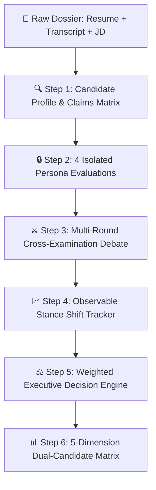

<div align="center">

# ⚖️ Multi-Agent AI Interview Panel Simulator
### *Evidence-Grounded Committee Deliberation • Observable Stance Shifts • Non-Averaging Synthesis*

[](https://www.typescriptlang.org/)
[](https://react.dev/)
[](https://tailwindcss.com/)
[](https://expressjs.com/)
[](https://ai.google.dev/)
[](https://opensource.org/licenses/MIT)

<p align="center">
  A state-of-the-art multi-agent hiring committee simulator built to eliminate confirmation bias, early groupthink, and unverified resume claims through isolated expert assessments, adversarial cross-examination, observable opinion concessions, and multi-factor weighted decision synthesis.
</p>

[✨ Live Preview](#-system-architecture) • [🧠 The 4 Agent Personas](#-the-4-isolated-agent-personas) • [🔄 Deliberation Pipeline](#-end-to-end-deliberation-pipeline) • [⚡ Getting Started](#-getting-started) • [📊 Candidate Dossiers](#-candidate-case-studies)

</div>

---

## 📌 Executive Summary

Hiring high-stakes engineering roles using standard single-prompt LLM evaluation frequently results in **halo effects**, **superficial keyword matching**, and **inability to detect teammate credit inflation**. 

This system models a real-world **4-Agent Executive Hiring Panel** that enforces:
1. **Zero Early Contamination**: Agents evaluate candidate transcripts and resumes completely in isolation.
2. **Mandatory Evidence Grounding**: Every point of praise or concern requires a direct quote from the transcript or resume.
3. **Observable Stance Shifts**: Cross-examination forces agents to defend their ratings or explicitly concede and adjust their score when peer evidence proves contradiction.
4. **Weighted Reasoning Engine**: A non-averaging synthesis engine that prioritizes integrity, operational reliability, and retention over unverified velocity.

---

## 🧠 The 4 Isolated Agent Personas

```
                     ┌──────────────────────────────────────────────┐
                     │          Candidate Dossier & Transcript      │
                     └──────────────────────┬───────────────────────┘
                                            │
               ┌────────────────────────────┼───────────────────────────┐
               ▼                            ▼                           ▼                           ▼
  ┌─────────────────────────┐  ┌─────────────────────────┐  ┌─────────────────────────┐  ┌─────────────────────────┐
  │   Dr. Alex Vance        │  │   Elena Rostova         │  │   Marcus Sterling       │  │   Devon Cross           │
  │   Principal AI Architect│  │   VP People & Culture   │  │   Director of Eng       │  │   Senior Red-Team Review│
  ├─────────────────────────┤  ├─────────────────────────┤  ├─────────────────────────┤  ├─────────────────────────┤
  │ • Multi-Agent Topology  │  │ • Credit Attribution    │  │ • Ramp-up Buffer        │  │ • Resume vs Transcript  │
  │ • SLM Cost Routing      │  │ • Mistake Ownership     │  │ • On-Call Reliability   │  │ • Metric Verification   │
  │ • Failure Loop Handling │  │ • Retention Flight Risk │  │ • Team Output Velocity  │  │ • Unverified Assertions │
  └─────────────────────────┘  └─────────────────────────┘  └─────────────────────────┘  └─────────────────────────┘
```

| Persona | Role | Focus Area | Scrutiny Benchmark |
|:---|:---|:---|:---|
| **Dr. Alex Vance** | Principal AI Architect | **Technical Architecture** | Evaluates planner-executor-reviewer workflows, section-based RAG chunking, SLM vs LLM cost routing, and distributed state machines. |
| **Elena Rostova** | VP of People & Culture | **Culture & Teamwork** | Scrutinizes credit attribution (e.g. *Did you write the code or did your teammate?*), incident retrospectives, and psychological safety. |
| **Marcus Sterling** | Director of Engineering | **Hiring Manager ROI** | Weighs onboarding velocity vs. risk, on-call incident readiness, team stability, and long-term business ROI. |
| **Devon Cross** | Senior Staff Red-Team | **Skeptic / Fact-Checker** | Adversarially tests claims, unmasks unverified percentages (e.g., *~40% accuracy gains*), and checks for deceptive inflation. |

---

## 🔄 End-to-End Deliberation Pipeline



### 1️⃣ Candidate Profile & Claim Extraction
Extracts technical proficiencies, education, career timeline, and builds an active **Claim Verification Matrix** mapping stated resume achievements against transcript admissions.

### 2️⃣ Isolated Agent Assessments
Each agent generates an independent evaluation with:
- **Score (1.0 - 10.0)** & **Confidence Rating (%)**
- **Structured Strengths & Concerns** mapped directly to line-item transcript quotes.
- **Isolated Proof Statement** proving lack of peer bias.

### 3️⃣ Cross-Examination Debate & Stance Modification
- **Round 1 (Direct Challenge)**: Skeptic/Technical agents challenge high scores using transcript admissions.
- **Round 2 (Rebuttal & Concession)**: Challenged agents review peer evidence, acknowledge discrepancies, and execute an explicit **Stance Concession**.
- **Speech Synthesis (Bonus Feature)**: Differentiated vocal pitch and tempo for each agent during live audio playback.

### 4️⃣ Weighted Executive Decision (Rule 4: Not Simple Averaging)
The synthesis engine applies multi-factor algorithmic weighting:
$$\text{Weighted Score} = (w_{\text{tech}} \times S_{\text{tech}}) + (w_{\text{hr}} \times S_{\text{hr}}) + (w_{\text{hm}} \times S_{\text{hm}}) + (w_{\text{skep}} \times S_{\text{skep}})$$
*Penalizes dishonesty and operational blindspots while rewarding transparent ownership and safety checklists.*

### 5️⃣ Dual-Candidate Head-to-Head Comparison
Evaluates candidates across 5 key dimensions:
- **Multi-Agent Technical Depth**
- **Intellectual Honesty & Integrity**
- **Production Ownership & Reliability**
- **Ramp-Up Speed & Learning Agility**
- **Retention & Team Culture Fit**

---

## 📊 Candidate Case Studies

```
                    ┌─────────────────────────┬─────────────────────────┐
                    │ Candidate A: Rohan      │ Candidate B: Ananya     │
                    ├─────────────────────────┼─────────────────────────┤
  Initial Verdict   │ LEAN HIRE (7.8)         │ LEAN NO HIRE (6.2)      │
  Debate Concession │ Dropped to 4.8          │ Upgraded to 8.3         │
  Final Decision    │ ❌ REJECT (NO HIRE)     │ ✅ EXTEND OFFER (HIRE)  │
                    └─────────────────────────┴─────────────────────────┘
```

### 🔴 Candidate A: Rohan Malhotra (*"The Prototype Sprinter"*)
- **The Pitch**: Claims sole authorship of a multi-agent retry engine handling 5,000+ exceptions/month at Voltrix.
- **The Cross-Examination**: Under Skeptic interrogation (Q7), admits teammate *Priya* wrote the bulk of the production code. In Q3, admits not knowing his system's override rate. In Q10, reveals 3 jobs in 3.5 years driven by short-term title hops.
- **The Stance Shift**: Technical Agent concedes and drops score from **7.8 → 6.2**; Hiring Manager flips to **LEAN_NO_HIRE**.

### 🟢 Candidate B: Ananya Iyer (*"The Disciplined Systems Builder"*)
- **The Pitch**: 6 years of tenure at Bridgepoint; single-agent RAG experience; no production multi-agent framework on resume.
- **The Cross-Examination**: Proactively disclaims unverified resume benchmarks (Q2). In Q5–Q7, details how she caused a production outage, took full blame in the postmortem, and instituted pre-deploy prompt eval checklists.
- **The Stance Shift**: Technical Agent upgrades score from **6.2 → 7.4** upon realizing her rigorous engineering hygiene makes the 2-week multi-agent onboarding low risk.

---

## 🛠️ Tech Stack & Implementation Details

| Layer | Technologies | Key Role |
|:---|:---|:---|
| **Frontend** | React 19, TypeScript, Tailwind CSS v4 | Interactive deliberation arena, real-time audio debrief, and visual comparison matrix. |
| **Motion** | `motion/react` | Dynamic accordion transitions and smooth score shift animations. |
| **Icons & UI** | Lucide React | High-density semantic status indicators and metrics badges. |
| **Backend API** | Express.js, TypeScript, Vite Middleware | Unified single-call persona synthesis, multi-model fallback, and robust schema validation. |
| **AI Intelligence** | Google Gen AI SDK (`@google/genai`) | High-speed structured JSON parsing using `gemini-3.1-flash-lite` and `gemini-3.7-flash`. |
| **Audio** | Web Speech API | Client-side pitch-modulated voice playback for persona simulation. |

---

## ⚡ Getting Started

### 1. Prerequisites
- **Node.js** (v20.x or higher recommended)
- **npm** or **bun**
- A **Gemini API Key** from [Google AI Studio](https://aistudio.google.com/)

### 2. Installation
```bash
# Clone the repository
git clone https://github.com/your-username/multi-agent-interview-panel.git

# Navigate to project directory
cd multi-agent-interview-panel

# Install dependencies
npm install
```

### 3. Configure Environment Variables
Create a `.env` file in the root directory:
```env
GEMINI_API_KEY=your_google_gemini_api_key_here
```

### 4. Run Development Server
```bash
npm run dev
```
Open your browser and navigate to `http://localhost:3000`.

### 5. Build for Production
```bash
npm run build
npm start
```

---

## 📡 API Reference

#### `GET /api/candidates/all`
Instantly loads the complete dossier, independent opinions, debate messages, stance shifts, and comparative decision matrix for both candidates without consuming initial API quota.

#### `POST /api/evaluate/profile`
Extracts candidate skills, key claims, and verifies claims against interview transcripts.
```json
{
  "resumeText": "...",
  "transcriptText": "...",
  "jobDescription": "..."
}
```

#### `POST /api/evaluate/independent`
Runs unified 4-persona isolated evaluations with strict quote citations.

#### `POST /api/evaluate/debate`
Triggers the 2-round cross-examination debate and captures all numeric score deltas.

#### `POST /api/evaluate/decision`
Runs the weighted reasoning engine and synthesizes onboarding conditions and unresolved risks.

---

## 🛡️ Anti-Slop & Design Principles
- **No Generic AI Clichés**: Zero neon gradients, cyan text on dark backgrounds, or ungrounded vanity metrics.
- **Mathematical Layout Precision**: Follows strict nested corner radius calculations (`Inner = Outer - Padding`).
- **Complete Visual Accessibility**: Meets WCAG AA contrast standards with high-contrast slate and warm-neutral surfaces.
- **Evidence-First UX**: Clicking any score or claim highlights the exact supporting quote from the raw transcript.

---

## 📄 License
Distributed under the **MIT License**. See `LICENSE` for more information.

<div align="center">
  <sub>Built for the 3-Hour AI Multi-Agent Challenge • Powered by Google Gemini</sub>
</div>
